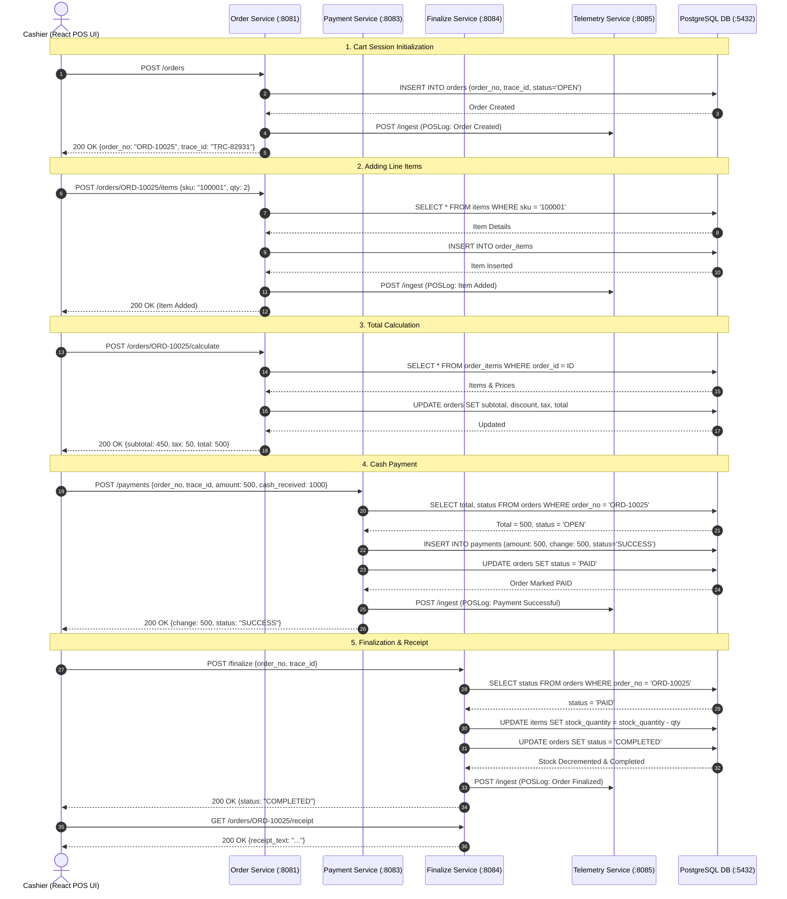
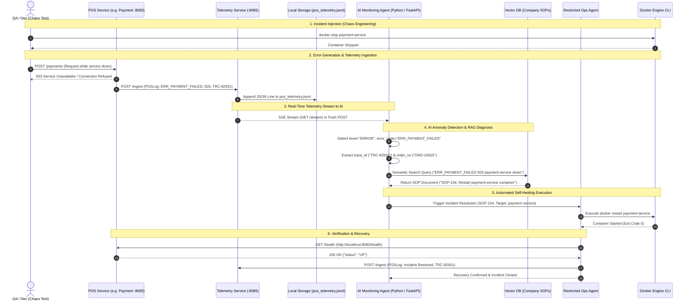

# Retail POS System & AI Ops Sequence Diagrams

This document contains full Mermaid sequence diagrams for both **Normal Retail POS Checkout Flow** and the **AI Incident Monitoring & Self-Healing Architecture**.

---

## 1. Normal Retail POS Transaction Flow

---

## 2. AI Telemetry Monitoring, Failure Detection & Self-Healing Architecture

