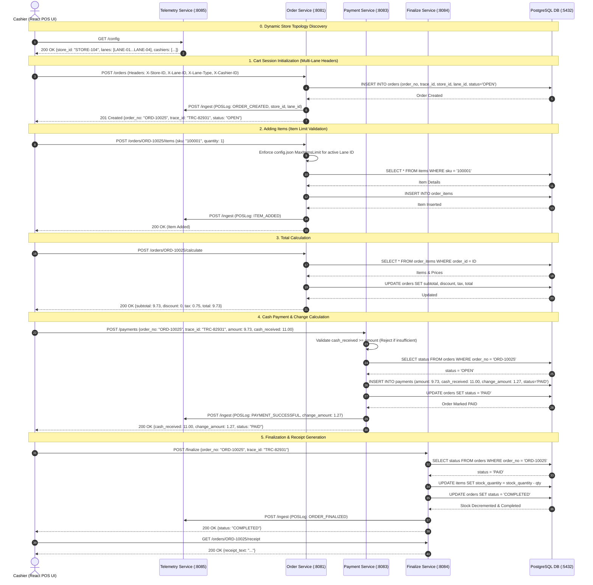
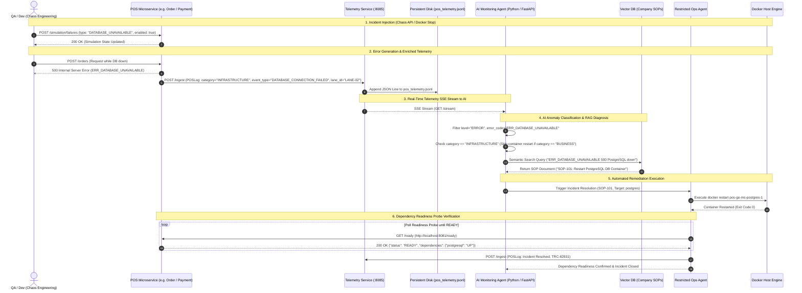

# Retail POS System & AI Ops Sequence Diagrams

This document contains updated Mermaid sequence diagrams for both **Multi-Lane Retail POS Checkout Flow** and the **AI Telemetry Monitoring, Readiness Verification & Self-Healing Architecture**.

---

## 1. Multi-Lane Retail POS Transaction & Config Boot Flow

---

## 2. AI Multi-Lane Monitoring, Error Classification & Readiness Probe Self-Healing

